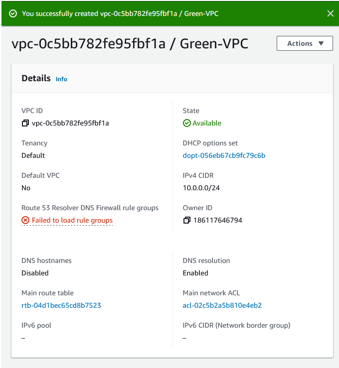
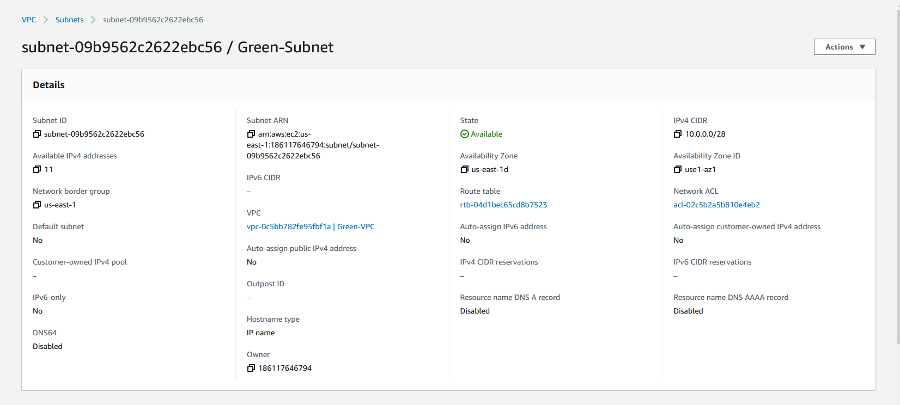
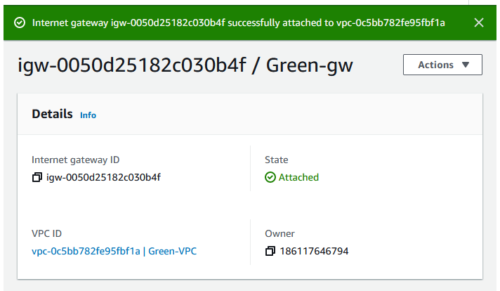
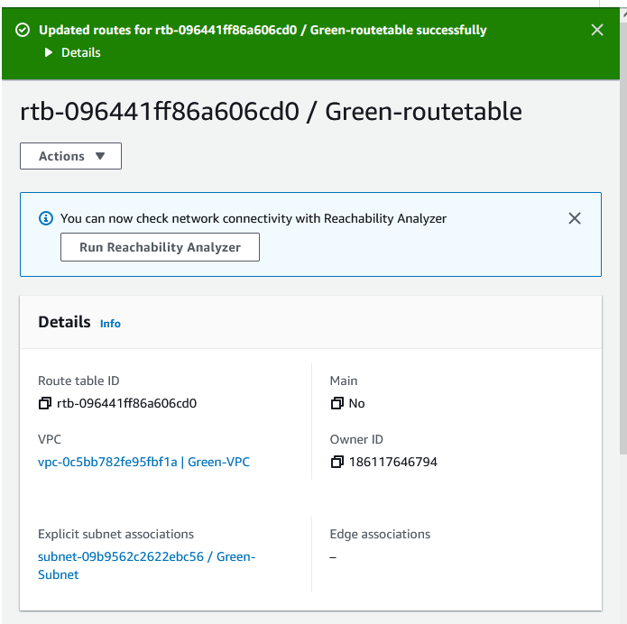
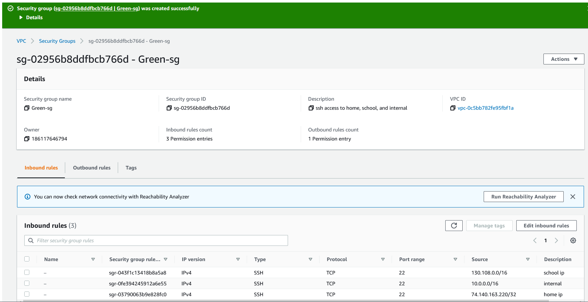
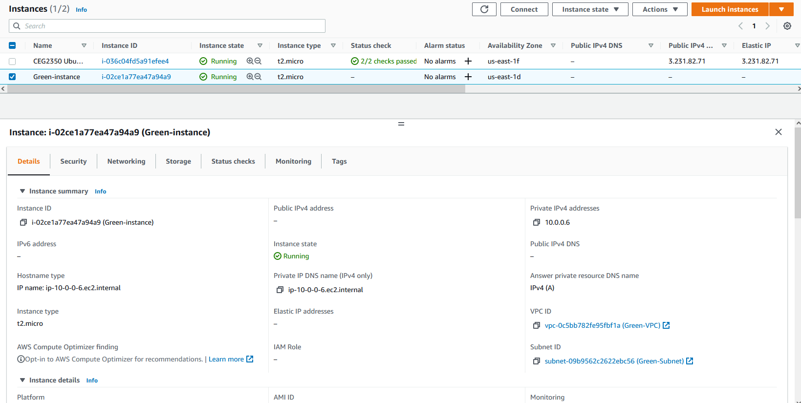
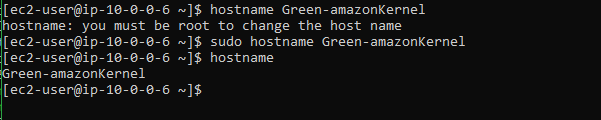

## J+M+J
# Part 1:

## 1.

## 2.

)

## 3.

## 4.

## 5.

)

## 6. (Used keypair already in existance)

# Part 2:

## 1. 
Selected: Amazon Linux 2 AMI (HVM) - Kernel 5.10
	Default Username: root

## 2. 
I selected the vpc in the 'Network' choice, which automatically filled in the other needed blanks (such as Subnet).

## 3. 
It will not be auto-assigned. This way it cannot change without my knowledge and I will always be able to use the same ip to access my vpc.

## 4. 
I added a new volume by the setup screen's 'Add New Volume' button.

## 5. 
Selecting the 'Add Tags' page, I clicked 'Click to Add Tag' in the setup menu

## 6. 
Selecting the 'Configure Security Group' page, I chose 'Select an existing security group' and selected my pre-made group.

## 7. 
Selecting the 'Elastic IPs' on the sidebar, I clicked 'Allocate Elastic IP address'. Once the ip was allocated, I chose 'Associate Elastic IP address' from the dropdown menu under 'Actions' and selected my EC2.

## 8. 

## 9. 
Used the command 'ssh -i ceg-3120-aws.pem ec2-user@52.1.232.41' to ssh into the instance. I then used 'sudo hostname Green-amazonKernel'.

## 10. 

