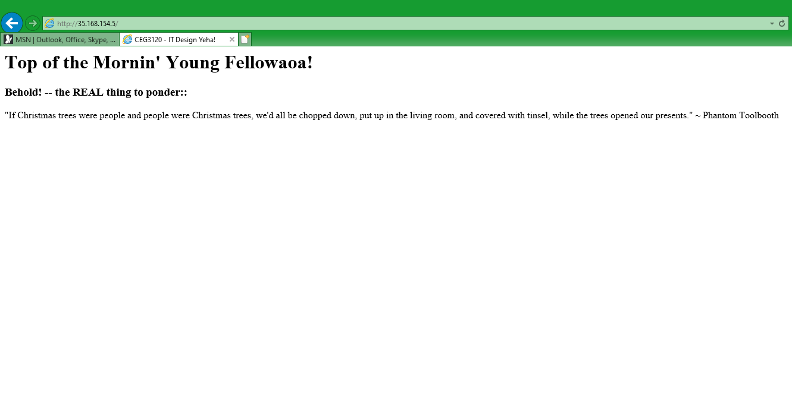

##J+M+J

###1. See below for each file format: 

	/etc/hosts file: is configured in the following manner:

	__ip_to_relate_to__ __shortcut_name__	

	.ssh/config file: is fonfigured in the follwing manner:

	Host __shortcut_name__

		HostName __ip_to_connect__

		User __user_name__

		IdentityFile __path_to_private_key__	 

##2. To ssh between the different systems, use the following command and format:

ssh -i __path_to_private_key__ __user_name__@__ip_to_connect__

To connect to the following servers, that would make the command as thus:

webserv1: ssh -i .ssh/keys/servers-aws.pem ubuntu@10.0.1.10

webserv2: ssh -i .ssh/keys/servers-aws.pem ubuntu@10.0.1.13

##3. HAProxy configuration details:
	
###a. haproxy.cfg was edited at: /etc/haproxy
	
###b. The back and front end were set up as the following:

		frontend 35.168.154.5			//global ip link

			bind 10.0.0.10			//local (proxy) ip link

			default_backend web_servers	//link to backend

		backend web_servers			//specifying what back end to set up

        		balance roundrobin		//how it distributes

        		option httpchk HEAD /		//the kind of health checks

        		server webserv1 10.0.1.10:80	//link to webserv1

        		server webserv2 10.0.1.13:80	//link to webserv2
	
###c. If a configuration change was needed, run: sudo systemctl restart haproxy
	
###d. Resources used:

		https://www.whatismyip.com/

		//(Yeah I know, shameful....)

		https://askubuntu.com/questions/729072/where-is-that-apache2-stored-after-installation

		Class recordings

		Help from instructor (Discord)

##4. Webserver configuration details:

###a. index.html at: /var/www/html 

###b. No configurations were changed.

###c. index.html was located and changed on each webserver so that the
		tester could see what server he was being hosted content from.

###d. If a file change was made, run: sudo systemctl restart apache2

###e. Resources used:

		Unknown resource.... 			

		//(I can't find it in my history... but I looked up where to find /var/www/html/index.html somewhere online) 

		https://phoenixnap.com/kb/how-to-vim-save-quit-exit

##5. Screenshot 1:
   

Screenshot 2:
   

##6. Link to Proxy: http://35.168.154.5/
